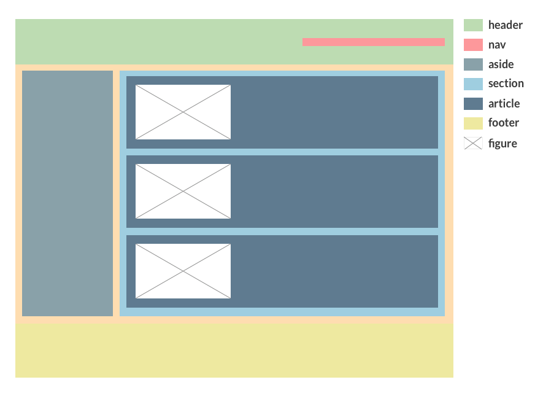
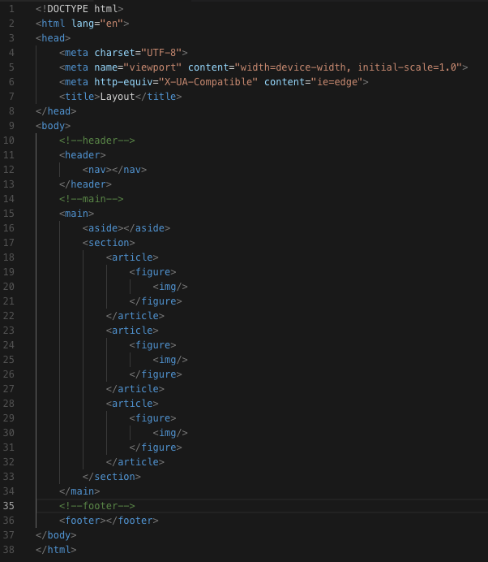
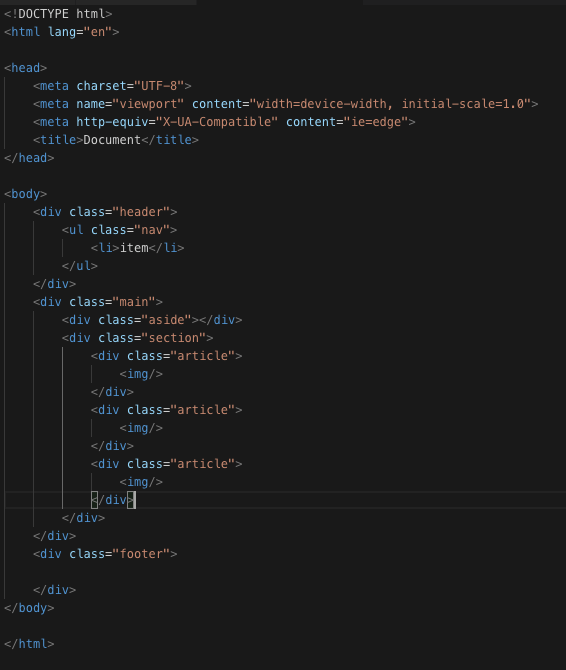

# HTML
HTML es un lenguaje de etiquetado, con el que podremos segmentar nuestro diseño utilizando las etiquetas correctas para poder luego aplicarle un diseño a este. Existen diferentes enfoques a la hora de escribir codigo HTML; esto dependera del objetivo del producto, podemos escribir codigo que sea amistoso para el [SEO](https://es.wikipedia.org/wiki/Posicionamiento_en_buscadores), utilizando etiquetas [semanticas](https://desarrolloweb.com/articulos/etiquetas-semanticas-html5.html), estructurando el contenido con [esquemas](https://platzi.com/blog/schema-seo/) y creando interfaces [accesibles](https://www.udemy.com/aprende-accesibilidad-web-paso-a-paso/) utilizando atributos de [accesibilidad](https://developers.google.com/web/fundamentals/accessibility/?hl=es). No existe una regla de como estructurar el html, pero si quieres obtener beneficios con el seo y la accesibilidad tendras que seguir las reglas del uso de etiquetas semanticas, metadata y roles de accesibilidad. Recuerden que un diseño es el conjunto de pequeños bloques que cumplen una funcion y conocer las etiquetas correctas para armar nuestro diseño nos ayudara a trabajar de manera mas rapida.

## Que son las etiquetas semanticas
Las etiquetas semanticas llegaron con la especificacion de __html5__, estas etiquetas nos ayudan a entender el significado de cada etiqueta y tambien nos ayudan a entender la distribucion del diseño con el uso correcta de estas. Las etiquetas semanticas son entendibles tanto por una persona como por los crawlers(rastreadores) de google y esto nos ayuda a la hora de posicionar nuestras paginas en los buscadores.

__Imaginemos el siguiente layout (distribucion de elementos dentro de un diseño)__

__Con html5 semantico el codigo se veria de la siguiente manera__.

Como pueden observar el codigo es descriptivo a simple vista y podemos darnos una idea de la estructura de nuestro diseño.

__Ahora comparemos un codigo antes de html5__

Como podemos observar el codigo se divide a travez de etiquetas __div__ estas etiquetas nos ayudan a seccionar nuestro diseño pero a simple vista no tiene ningun significado.

## Etiquetas
Las etiquetas se categorizan por:
* __Etiquetas meta__: son etiquetas que nos proporcionan informacion para el seo o referencian recursos, nos brindan informacion sobre la pagina.
* __Etiquetas scripting__: Para el manejo de js.
* __Etiquetas de seccionamiento__ Son etiquetas que nos ayudan a estructurar nuestro contenido
* __Etiquetas de agrupacion de contenido__ Son etiquetas para manejar el contenido del texto. Son importantes para la accesibilidad y el seo.
* __Etiquetas de definicion de una palabra, parrafo, estructura__ Son etiquetas que nos ayudan a definir el significado o estilo de una palabra, una linea o parrafo.
* __Etiquetas de imagen y multimedia__ Son etiquetas para referenciar imagenes , audio o video.
* __Etiquetas tipo tabla__ Etiquetas para manejar informacion tabulada.
* __Etiquetas de formulario__ Son etiquetas para manejar controles de formulario.

Las etiquetas categorizadas arriba son las mas utilizadas. Aprendiendo estas etiquetas obtendremos todo el conocimiento necesario para poder estructurar nuestros diseños.

## Enlaces de interes

* [Referencia de elementos html5](https://developer.mozilla.org/es/docs/HTML/HTML5/HTML5_lista_elementos)
* [html reference](https://htmlreference.io/)
* [meta etiquetas seo](http://www.analizosuweb.com/blog/como-usar-las-meta-etiquetas-de-html5/)
* [schema seo](https://platzi.com/blog/schema-seo/)
* [documentacion oficial schema](https://schema.org/)
* [Que es semantica](https://desarrolloweb.com/articulos/etiquetas-semanticas-html5.html)
* [Accesibilidad](https://developers.google.com/web/fundamentals/accessibility/?hl=es)
* [Curso de accesibilidad](https://www.udemy.com/aprende-accesibilidad-web-paso-a-paso/)
* [seo](https://es.wikipedia.org/wiki/Posicionamiento_en_buscadores)